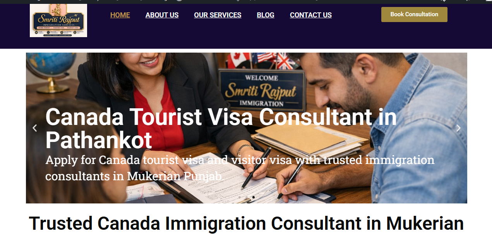
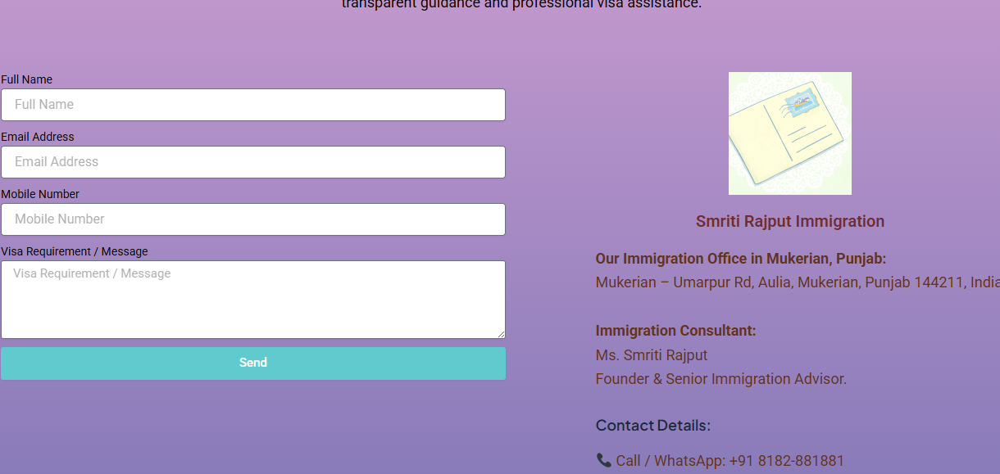
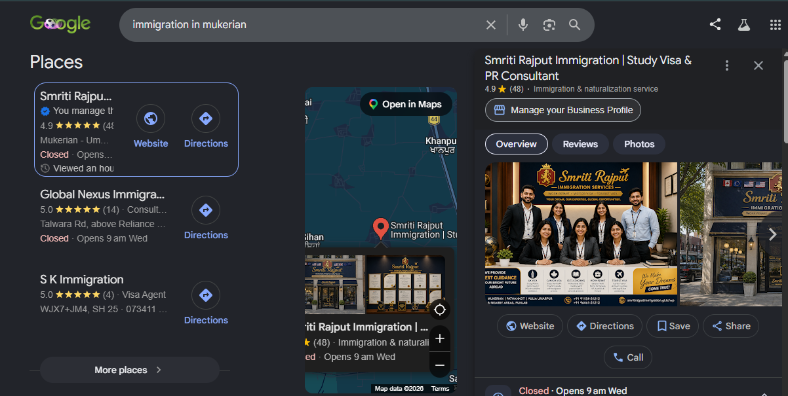

# Smriti Rajput Immigration

## 🌐 Live Website

https://smritirajputimmigration.com

---

## 📌 Project Overview

Smriti Rajput Immigration is a Digital Marketing and WordPress website project developed during my 6-month Digital Marketing Training Program.

The project was created to establish a professional online presence for an immigration consultancy business through website development, local SEO, Google Business Profile optimization, and search engine visibility improvements.

---

## 🎯 Project Objectives

* Create a professional WordPress website
* Purchase and configure domain and hosting
* Build an online presence for the business
* Create and optimize Google Business Profile (GMB)
* Implement On-Page SEO techniques
* Improve local search visibility
* Set up Google Search Console and Google Analytics

---

## 💼 My Responsibilities

### Website Development

* Purchased domain and hosting from Hostinger
* Installed and configured WordPress
* Designed website pages and navigation
* Created service and contact pages
* Optimized website structure and user experience

### Search Engine Optimization (SEO)

* Keyword Research
* Meta Title Optimization
* Meta Description Optimization
* URL Structure Optimization
* Internal Linking
* Image Optimization
* Mobile-Friendly Design

### Local SEO

* Google Business Profile Creation
* Business Information Optimization
* Service Area Setup
* Business Description Optimization
* Local Search Visibility Improvements

### Technical Setup

* Google Search Console Integration
* Google Analytics Integration
* XML Sitemap Setup
* Website Performance Optimization

---

## 🛠 Tools Used

* WordPress
* Hostinger
* Google Business Profile
* Google Search Console
* Google Analytics
* SEO Plugins

---

## 🚀 Skills Demonstrated

* Digital Marketing
* WordPress Website Development
* Search Engine Optimization (SEO)
* Local SEO
* Google Business Profile Optimization
* Content Marketing
* Website Management
* Analytics Setup
* Technical SEO

---

## 📊 Project Results

* Successfully launched a live business website
* Established an online presence for the business
* Created and optimized Google Business Profile
* Implemented Local SEO strategies
* Applied On-Page SEO best practices
* Connected Google Analytics and Search Console
* Improved website readiness for search engine indexing

---

## 📷 Project Screenshots

### Homepages

### Services Page

### Contact Page

### Google Business Profile

### Blog Page

---

## 🔗 Project Links

### Website

https://smritirajputimmigration.com

### GitHub Repository

https://github.com/smritisalaria/smriti-rajput-immigration

---

## 👤 Author

**Smriti Salaria**

Digital Marketing Trainee

### Key Areas of Interest

* SEO
* Local SEO
* WordPress Development
* Google Business Profile Optimization
* Content Marketing
* Digital Marketing Strategy

---

## 📚 Learning Outcome

This project helped me gain practical experience in:

* WordPress Website Creation
* Website Management
* Local SEO Implementation
* On-Page SEO Optimization
* Google Business Profile Management
* Search Console Setup
* Analytics Tracking
* Digital Marketing Strategy

---

## ⭐ Project Status

Completed and Live

